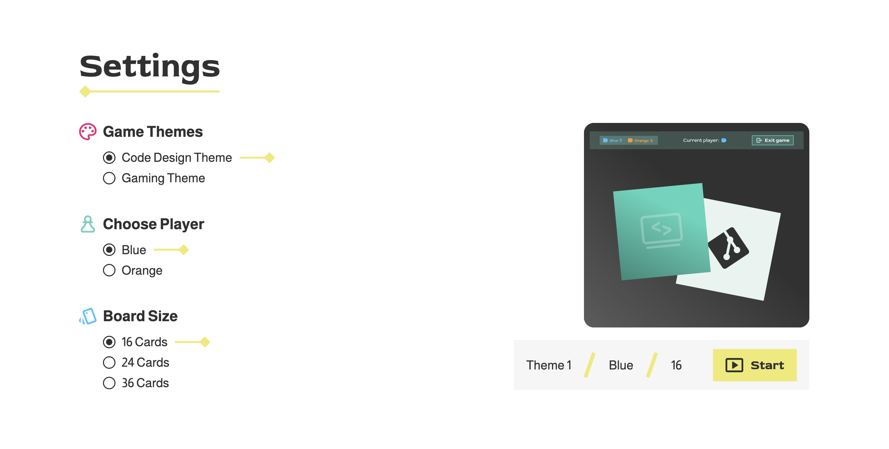
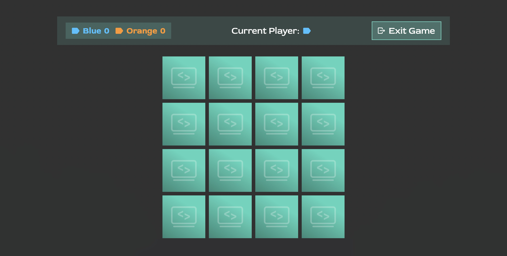

<h1 align="left">Memory</h1>

###

In this project, a memory game was created using TypeScript and SCSS. 

This game is part of the Developer Akademie's training programme for software developers (www.developerakademie.com). 
  

###

 
 
